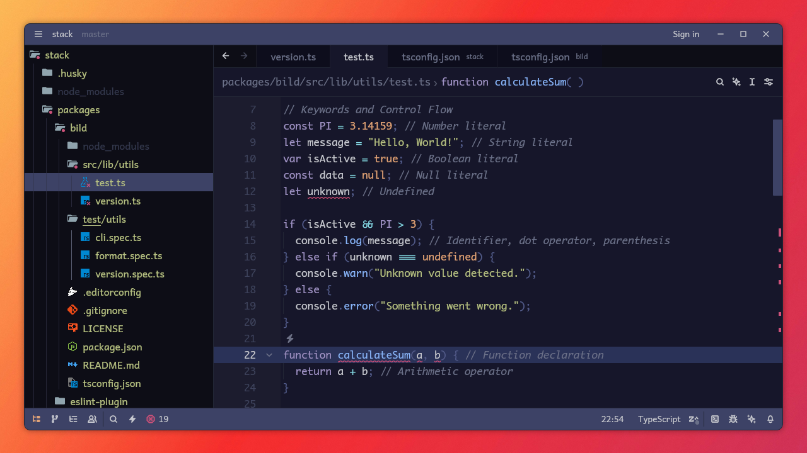

<h3 align="center">
	 
	Elderberry for <a href="https://zed.dev/" target="_blank" rel="noopener noreferrer">Zed</a>	
</h3>

  🫐 A dark purplish color scheme, a blend of <a href="https://github.com/efdos/iceberg-zed-theme" target="_blank" rel="noopener noreferrer">Iceberg</a> 
  with a hint of <a href="https://github.com/catppuccin/zed" target="_blank" rel="noopener noreferrer">Catppuccin</a>.

  

  

## Usage

1. Open Zed.
2. Open the command palette (<kbd>Cmd</kbd>+<kbd>Shift</kbd>+<kbd>P</kbd>) and enter **zed: extensions**.
3. Search for the **Elderberry** extension and install.
4. Enter **theme selector: toggle** in the command palette and select the **Elderberry** theme in the dropdown.

## License

Copyright © 2025 Jakka Prihatna.  
Licensed under the terms of the [Apache-2.0](LICENSE) license.
